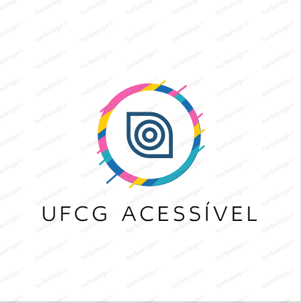

# UFCG-Acessivel



Este é o repositório oficial do projeto **UFCG Acessível**, desenvolvido como parte do Trabalho de Conclusão de Curso (TCC) do aluno João Vitor Patricio Romão, do curso de Ciência da Computação da Universidade Federal de Campina Grande (UFCG). O projeto foi realizado sob a orientação da professora Joseana Macêdo.

## Visão Geral

O **UFCG Acessível** é uma extensão que visa solucionar as falhas de acessibilidade encontradas na interface de usuário do **Controle Acadêmico Online**. Nosso objetivo é melhorar a usabilidade e a independência das pessoas com deficiência ao acessar suas informações acadêmicas pela web.

## Objetivos

- Melhorar a acessibilidade da interface de usuário do **Controle Acadêmico Online** da UFCG.
- Tornar a experiência de uso mais confortável e independente para pessoas com deficiência.
- Desenvolver um software assistivo que atenda às necessidades e níveis de conhecimento variados dos usuários.
- Seguir as diretrizes do **WCAG** (Web Content Accessibility Guidelines) para garantir uma interface perceptível, operável, compreensível e robusta.

## Funcionalidades Principais

- Suporte a leitores de tela para facilitar a navegação e compreensão do conteúdo.
- Ajustes de contraste e tamanho da fonte para melhorar a legibilidade.
- Opções de navegação simplificadas e teclas de atalho personalizáveis.
- Notificações e alertas visuais para informações importantes.
- Otimização da estrutura do código e uso adequado de elementos semânticos.

## Requisitos de Sistema

- Navegadores compatíveis: Chrome, Firefox, Safari.
- Sistema operacional: Windows, macOS, Linux.

## Instalação

1. Clone este repositório em sua máquina local.
```
git clone https://github.com/seu-usuario/ufcg-acessivel.git
```
2. Abra o navegador de sua preferência.
3. Acesse as configurações de extensões ou complementos do navegador.
4. Habilite o **Modo de desenvolvedor** caso necessário.
5. Selecione a opção **Carregar extensão não empacotada** ou similar.
6. Navegue até o diretório onde o repositório foi clonado e selecione a pasta **ufcg-acessivel**.
7. A extensão **UFCG Acessível** estará disponível para uso.

## Contribuição

Contribuições são bem-vindas! Se você deseja contribuir para o desenvolvimento deste projeto, siga as etapas abaixo:

1. Faça um fork deste repositório.
2. Crie uma branch para suas alterações.
```
git checkout -b minha-branch
```
3. Faça as alterações desejadas e faça commit das mesmas.
```
git commit -m "Minhas alterações"
```
4. Faça push das alterações para o seu fork.
```
git push origin minha-branch
```
5. Abra um pull request neste repositório, descrevendo suas alterações.
